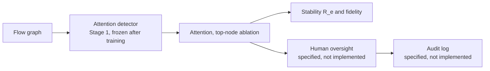

# Architecture

```mermaid
flowchart LR
  G[Flow graph] --> D[Attention detector<br/>Stage 1, frozen after training]
  D --> E[Attention, top-node ablation]
  E --> R[Stability R_e and fidelity]
  E --> H[Human oversight<br/>specified, not implemented]
  H --> A[Audit log<br/>specified, not implemented]
```

Layers 3 and 4 in the concept paper (role-specific views, decision logs, NIST AI RMF GOVERN evidence) are deliberately not stubbed with fake analyst scores.
