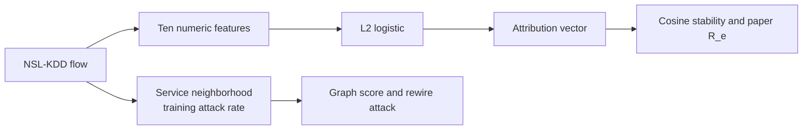

# Architecture

```mermaid
flowchart LR
  F[NSL-KDD flow] --> S[Service neighborhood<br/>training attack rate]
  F --> N[Ten numeric features]
  N --> L[L2 logistic]
  S --> E[Graph score and rewire attack]
  L --> A[Attribution vector]
  A --> R[Cosine stability and paper R_e]
```

The detector is one graph-attention layer over same-service neighbors. The service-rate score and the numeric logistic are the baselines beside it.
